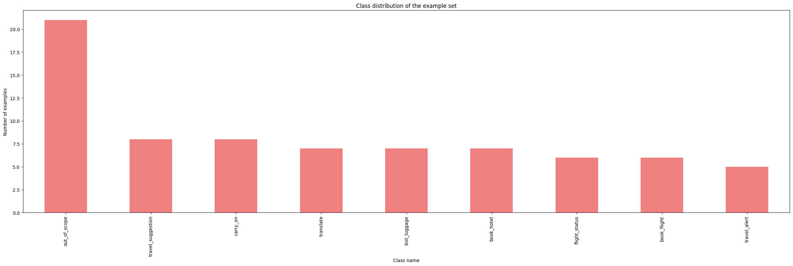
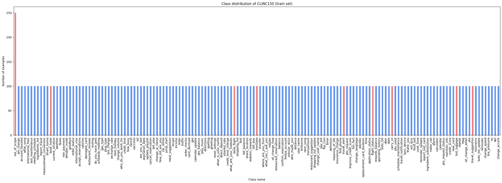
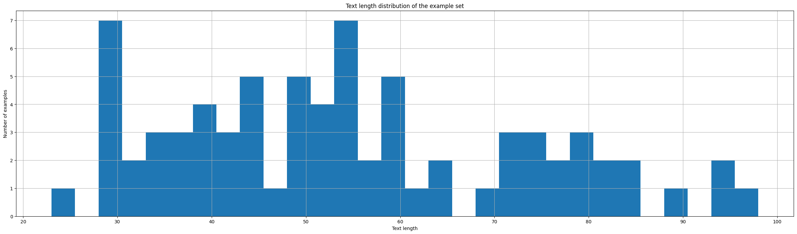
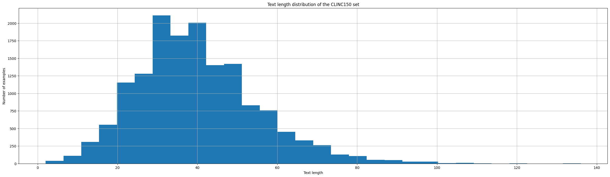

# Intent Classification Pipeline for French Text Inputs

This repository contains the code for an Intent Classification pipeline (data pre-processing - pre-trained embeddings - model training/finetuning, command line interface) for french text inputs. It is based on the [CLINC150 dataset](https://github.com/clinc/oos-eval) and explores several techniques to tackle the task.

Thank you ILLUIN Technology for this opportunity!

## Instructions summarised
- We want an algorithm classifying a french text input into one of 9 classes:
  - translate
  - travel_alert
  - flight_status
  - lost_luggage --> need high precision + need to print warning about costs
  - travel_suggestion
  - carry_on
  - book_hotel
  - book_flight
  - out_of_scope (if none of the above)

- We should choose metrics to evaluate the algorithm quality
- We need a python script running a prediction on a text input
- We need a python script evaluating the chosen model on a test set (csv)
- We need the user input prediction to run in a reasonable time (less than 1s)
- We should compare multiple techniques

## Getting Started

1. Clone this repository:
```bash
git clone https://github.com/rayandaod/intent-classification.git
```

2. Create a virtual environment (e.g with conda):
```bash
conda create -n intent_class_env python=3.10.9
conda activate intent_class_env
```

3. Install the dependencies:
```bash
python -m pip install -r requirements.txt
```

## Quick Start Prediction

### Best recipe

This recipe consists in getting a sentence embedding from the user input using the pre-trained Sentence CamemBERT model, and training a logistic regression on the translated CLINC150 dataset (filtered to only contain the classes above). It can be used as follows:
  
```bash
  python run_chatbot.py --verbose
```

A command-line chat interface should appear, in which case you will be prompted to enter an input. The model will output the predicted class, and repeat. To exit the chat, use Ctrl+C.

**Warning**: the first time you run the model, it will download the Sentence CamemBERT model, which is quite large. It might take a few minutes. The model will be cached for future runs.

### The english recipe

This model consists in translating the user input to english using a [french-to-english translation model]() and a [model pre-trained on CLINC150](https://huggingface.co/dbounds/roberta-large-finetuned-clinc) (in english). It can be used as follows:
  
```bash
  python run_chatbot.py --model en --verbose
```

I was worried about the translation time but it's actually pretty fast. A prediction takes xx.xx seconds on my machine (14" MacBook Pro, Apple M1 Pro, 32 GB RAM).

## Quick Start Evaluation

To evaluate a model on a test set (CSV file, as requested in the instructions), use the following command:

```bash
  python evaluate.py --model [model_folder_name] --dataset path/to/dataset.csv --verbose
```

### CLINC150 "plus" test set

This test set is the CLINC150 ("plus" version) test set translated to french. It is located in `data/test.csv`.

Preprocessing steps:
- First the `oos1` strategy, and `down` preprocessing step are adopted (see data preprocessing section at the bottom)
- Then the `carry` step is applied to enhance the *carry_on* class for translation to french (see data preprocessing section at the bottom)
- The dataset was finally translated to french using the Helsinki-NLP/opus-mt-tc-big-en-fr model (see translation section at the bottom)

The results are averaged over the entire dataset.

| Model | Accuracy | Precision | Recall | F1-score | Speed |
| ----- | -------- | --------- | ------ | -------- | ----- |
| Sentence-CamemBERT-Large | 0.97 | 0.98 | 0.97 | 0.98 | 0.12s |
| Sentence-CamemBERT-Base | 0.95 | 0.97 | 0.94 | 0.95 | 0.05s |
| English pre-trained | 0.97 | 0.98 | 0.97 | 0.97 | 0.74s |
| FlauBERT-Base-Uncased (avg) | 0.63 | 0.65 | 0.62 | 0.63 | 0.05s |
| FlauBERT-Base-Uncased (avg-norm) | 0.57 | 0.69 | 0.51 | 0.56 | 0.05s |
| FlauBERT-Base-Uncased (sum) | 0.52 | 0.54 | 0.52 | 0.52 | 0.05s |
| FlauBERT-Base-Uncased (sum-norm) | 0.57 | 0.69 | 0.51 | 0.56 | 0.05s |


### Example test set (imbalanced, small)

It was provided to me and is located in `data/ILLUIN/examples.csv`.

Although this test set is too small and imbalanced to be used for training, we are including it for completeness.

The results are averaged over the entire dataset.

| Model | Accuracy | Precision | Recall | F1-score | Speed |
| ----- | -------- | --------- | ------ | -------- | ----- |
| Sentence-CamemBERT-Large | 0.96 | 0.96 | 0.98 | 0.97 | 0.13s |
| Sentence-CamemBERT-Base | 0.96 | 0.96 | 0.98 | 0.96 | 0.05s |
| English pre-trained | 0.95 | 0.96 | 0.95 | 0.95 | 0.68s |
| FlauBERT-Base-Uncased (avg) | 0.60 | 0.61 | 0.62 | 0.61 | 0.05s |
| FlauBERT-Base-Uncased (avg-norm) | 0.57 | 0.67 | 0.52 | 0.56 | 0.05s |
| FlauBERT-Base-Uncased (sum) | 0.57 | 0.60 | 0.60 | 0.59 | 0.05s |
| FlauBERT-Base-Uncased (sum-norm) | 0.57 | 0.67 | 0.52 | 0.56 | 0.05s |


## Thought process, challenges,  ideas
#### Model
- Why do we need ML? We could build a list of trigger words for each class and output the corresponding class whenever one of its trigger words appear. But: 
  - There are many ways to say the same thing -> cannot build an exhaustive list easily (there might be some words that we didn't think of)
  - There might exist more complex patterns that we didn't think of
  - This is not robust to typos and other errors
  - Maybe different words of different classes can appear in the same sentence -> what decision to make then?
  - ML/DL can tackle all the above given the right data and care, so it seems more appropriate
- First trial: find a pre-trained model on this exact task (model pre-trained on french language, finetuned for text classification with the same classes) -> didn't find any
- Try good ol' method: remove stopwords -> pre-trained word/sentence embeddings -> train simple ML classifier (logistic regression, decision tree, random forest, ...). To do that we need train/test sets. This might not yield the best results but it's a good baseline.
- Maybe there exists pre-trained english models for this task? [yes](https://huggingface.co/ASCCCCCCCC/distilbert-base-uncased-finetuned-clinc)
  - One way would be to use french-to-english translation + this model at inference time
    - Performance? Speed?
    - Was trained on much more classes (CLINC dataset) -> consider predicted classes other than our 8 first classes as *out_of_scope*.
- Once we have french data, we can find a model pre-trained on french language and finetune it on our data. 
#### Data
- We don't have a balanced nor large enough test set for evaluation -> Find a larger and balanced dataset for evaluation.
  - Idea: take the CLINC150 dataset and translate it to french. Then take a french language model and fine-tune it on the classes of interest. Pros: no translation needed at inference time.

## About the datasets

### Examples dataset

I was given a csv file (`data/ILLUIN/examples.csv`) containing some examples of user inputs and their corresponding class. However, this dataset is way too small and imbalanced to train a model and will only serve as an example set:



### CLINC150 dataset

I looked for a larger dataset. Naturally, I chose the [CLINC150 dataset](https://github.com/clinc/oos-eval), which consists in 150 classes (intents) over 10 domains and includes the 8 classes we are interested in. The dataset also contains one label for *out-of-scope* intent. It has three available versions:
- *small*: 50 training queries per each in-scope intent
- *imbalanced*: intents have either 25, 50, 75, or 100 training queries
- *plus*: 250 out-of-scope training examples, rather than 100

I chose the *plus* version to have more data:



It is also important to check that the CLINC150 dataset contains user inputs of roughly the same length as the ones in the examples.csv:





The CLINC150 dataset text length range covers the examples.csv text length range, so we are good to go.

### About the translation from english to french

TODO

## About the data preprocessing

I identified the following steps to preprocess the data before training the models or running inference. They are implemented in the `src/preprocess.py` file, and the chosen recipe can be specified in `config.yaml`:
- Handle the *out_of_scope* class
  - `oos1`: all the classes except the ones of interest are considered as *out_of_scope*
  - `oss2`: only the original *out_of_scope* class is considered as *out_of_scope*. The classes we are not interested in are removed
  - `oos3`: only keep the classes of interest, and return *out_of_scope* based on a threshold (e.g if the model is not confident enough)
- `down`: Downsample the *out_of_scope* class if needed
- `carry`: Enhance the carry_on class for translation to french. This is needed because the translation model is not very good at translating this class - I noticed that "carry on" is often translated to "continuer" (which is not the meaning we want here). Therefore, I replaced "carry on" by "carry on luggage", or "carry on bag", ... in the training data.
- `trans`: Translate the dataset to french
- `stop`: Remove stopwords if using word embeddings
- Compute embeddings
  - `flaubert`: Either compute individual word embeddings (using FlauBERT)
  - `sentenceCamembert`: Or use sentence embeddings (using Sentence CamemBERT)
- `avg`: Merge the word embeddings by averagoing them
- `sum`: Merge the word embeddings by summing them

The above keywords can be combined in `training_data_prep` (preprocessing applied to the training data only) and `training_inference_data_prep` (preprocessing applied to training **and** inference) to specify the pipeline.

## About the english pipeline

The english pipeline consists in translating the user input to english using a [french-to-english translation model]() and a [model pre-trained on CLINC150](https://huggingface.co/dbounds/roberta-large-finetuned-clinc) (in english).

The translation model was chosen among the following, based on reproted BLEU, chrF scores, and test set diversity:
- https://huggingface.co/Helsinki-NLP/opus-mt-tc-big-en-fr (chosen)
- https://huggingface.co/Helsinki-NLP/opus-mt-en-fr

The model pre-trained on CLINC150 was chosen based on its popularity. A deeper model evaluation and comparison (especially the tradeoff between performance and model size) would be needed before going to production with this method.

## TODO
- [ ] Try different filtering startegies for oos (keep only original oos + downsample, or consider other classes as oos + downsample, or remove oos and other classes and return oos based on threshold)
- [x] Translate custom CLINC150 dataset to french
- [x] Word embeddings summed/averaged using (FlauBERT encoder)
- [ ] Reduce dimensionality of embeddings (e.g PCA)
- [x] Train various simple classifiers
  - [x] Logistic Regression
  - [x] XGBoost
  - [x] Decision Tree
  - [x] Random Forest
  - [x] Gradient Boosting
  - [x] AdaBoost
  - [x] MLP
- [x] Find a way to compare model performances
- [x] Implement the english pipeline (translate french input to english + pre-trained english model inference)
- [x] Sentence embedding (Sentence CamemBERT)
- [ ] Fine-tune a french language model on translated CLINC150 dataset
- [ ] Check the licenses of the models used
- [ ] Complete the readme and comment the code properly
- [x] Add a requirements.txt file

## 
If you are working with others, they should also install nbstripout and run nbstripout --install in the repository to ensure that their commits also have the notebook outputs stripped.

