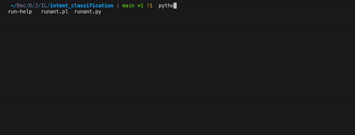

# Intent Classification Pipeline for French Text Inputs

This repository contains the code for an Intent Classification pipeline (data pre-processing - pre-trained embeddings - model training/finetuning, command line interface) for french text inputs. It is based on the [CLINC150 dataset](https://github.com/clinc/oos-eval) and explores several techniques to tackle the task.

Thank you ILLUIN Technology for this opportunity!

## Demonstration



## Instructions summarised
- We want an algorithm classifying a french text input into one of 9 classes:
  - translate
  - travel_alert
  - flight_status
  - lost_luggage `--> need high recall + need to print warning about costs`
  - travel_suggestion
  - carry_on
  - book_hotel
  - book_flight
  - out_of_scope (if none of the above)

- We should choose metrics to evaluate the algorithm quality
    
    `--> Done. We will use accuracy, precision, recall, and F1-score. To take into account the instructions, we take a closer look at the out_of_scope and lost_luggage recall (because we want the least number of false negatives).`
- We need a python script running a prediction on a text input
    
    `--> Done + added a command-line chat interface`
- We need a python script evaluating the chosen model on a test set (csv)
    
    `--> Done + added a test set (CLINC150 "plus" test set translated to french)`
- We need the user input prediction to run in a reasonable time (less than 1s)
    
    `--> This was achieved for all models for the typical text length (see evaluation script and folders)`
- We should compare multiple techniques
    
    `--> Data preprocessing: out_of_scope class handling, carry_on enhancer before translation, stopwords removal, ...`

    `--> FlauBERT sum/avg word embeddings + logistic regression`

    `--> Sentence CamemBERT + logistic regression`

    `--> Translation + English pre-trained model`

## Getting Started

1. Clone this repository:
```bash
git clone https://github.com/rayandaod/intent-classification.git
cd intent-classification
```

2. Create a virtual environment (e.g with conda):
```bash
conda create -n intent_class_env python=3.10.9
conda activate intent_class_env
```

3. Install the dependencies:
```bash
python -m pip install -r requirements.txt
```

4. Eventual collaborators should install `nbstripout` to avoid committing notebook outputs:
```bash
nbstripout --install
```

## Quickstart - Run the chatbot

### Using model `logReg_camembert`

This model was trained using the `camembert` recipe (see below for more info). This recipe consists in getting a sentence embedding from the user input using a pre-trained [Sentence CamemBERT base model](https://huggingface.co/dangvantuan/sentence-camembert-base), and training a logistic regression on the translated CLINC150 dataset (filtered to only contain the classes above). It can be used as follows:
  
```bash
  python run_chatbot.py --model logReg_camembert --verbose
```

A command-line chat interface should appear, in which case you will be prompted to enter an input. The model will output the predicted class, and repeat. To exit the chat, use Ctrl+C.

### Using model `camembert_large`

Same as above, but using the [Sentence CamemBERT large model](https://huggingface.co/dangvantuan/sentence-camembert-large). It can be used as follows:
  
```bash
  python run_chatbot.py --model logReg_camembert_large --verbose
```

### Using the pre-trained English model

This is the lazy approach. It consists in translating the user input to english using a [french-to-english translation model](https://huggingface.co/Helsinki-NLP/opus-mt-tc-big-en-fr) and a [model pre-trained on CLINC150](https://huggingface.co/dbounds/roberta-large-finetuned-clinc) (in english) at inference time. It can be used as follows:
  
```bash
  python run_chatbot.py --model english --verbose
```

Note: the results are good but the model can be slow depending on the text length.

## Quick Start - Model Evaluation

To evaluate a model on a chosen test set (CSV file, as requested in the instructions), use the following command:

```python evaluate.py --model [model_folder_name] --dataset path/to/dataset.csv --verbose```

### Evaluation on the CLINC150 "plus" test set

To evaluate a model on the CLINC150 "plus" test set, use the following command:

```bash
python evaluate.py --model logReg_camembert --test_path data/test_oos1_down_carry_trans.csv --eval_name test_set --verbose
```

Or to evaluate the pre-trained English model:

```bash
python evaluate.py --model english --test_path data/test_oos1_down_carry_trans.csv --eval_name test_set --verbose
```

The results are saved in `model_zoo/[model_folder_name]/eval_[eval_name]_[timestamp]/`.

Remarks:

I chose the CLINC150 ("plus" version) test set, translated to french using [this model](Helsinki-NLP/opus-mt-tc-big-en-fr). It is located at `data/test_oos1_down_carry_trans.csv`.

Since the original CLINC150 dataset is in english and contains much more classes, I processed it as follows:
- First the `oos1` strategy, and `down` (`proportion=2.5`) preprocessing step are adopted (see data preprocessing section at the bottom)
- Then the `carry` step is applied to enhance the *carry_on* class for translation to french (see data preprocessing section at the bottom)
- The dataset was finally translated to french using the previously mentioned model

Results (averaged over the entire dataset):

| Model | Accuracy | Precision | Recall | F1-score | Speed |
| ----- | -------- | --------- | ------ | -------- | ----- |
| Sentence-CamemBERT-Large | 0.97 | 0.98 | 0.97 | 0.98 | 0.12s |
| Sentence-CamemBERT-Base | 0.95 | 0.97 | 0.94 | 0.95 | 0.05s |
| English pre-trained | 0.97 | 0.98 | 0.97 | 0.97 | 0.74s |
| FlauBERT-Base-Uncased (avg) | 0.63 | 0.65 | 0.62 | 0.63 | 0.05s |
| FlauBERT-Base-Uncased (avg-norm) | 0.57 | 0.69 | 0.51 | 0.56 | 0.05s |
| FlauBERT-Base-Uncased (sum) | 0.52 | 0.54 | 0.52 | 0.52 | 0.05s |
| FlauBERT-Base-Uncased (sum-norm) | 0.57 | 0.69 | 0.51 | 0.56 | 0.05s |

More evaluation result details can be found inside the model folders.

### Evaluation on the example test set (imbalanced, small)

This set was provided to me and is located in `data/examples.csv`. Although this test set is too small and imbalanced to be used for training, we are including it for completeness. The results are averaged over the entire dataset:

| Model | Accuracy | Precision | Recall | F1-score | Speed |
| ----- | -------- | --------- | ------ | -------- | ----- |
| Sentence-CamemBERT-Large | 0.96 | 0.96 | 0.98 | 0.97 | 0.13s |
| Sentence-CamemBERT-Base | 0.96 | 0.96 | 0.98 | 0.96 | 0.05s |
| English pre-trained | 0.95 | 0.96 | 0.95 | 0.95 | 0.68s |
| FlauBERT-Base-Uncased (avg) | 0.60 | 0.61 | 0.62 | 0.61 | 0.05s |
| FlauBERT-Base-Uncased (avg-norm) | 0.57 | 0.67 | 0.52 | 0.56 | 0.05s |
| FlauBERT-Base-Uncased (sum) | 0.57 | 0.60 | 0.60 | 0.59 | 0.05s |
| FlauBERT-Base-Uncased (sum-norm) | 0.57 | 0.67 | 0.52 | 0.56 | 0.05s |

## Preprocess the data, train a model, infer, and evaluate

If you wish to reproduce the whole process, or improve it, you can follow the steps below.

### Data preprocessing

The data preprocessing steps are implemented in `src/preprocess.py`. The chosen recipe can be specified in `config.yaml`. Each recipe can be defined as:

```yaml
recipe_name: {
  clinc150_version: "plus",  # "small", "imbalanced", "plus"
  training_data_prep: [...],  # see below
  training_inference_data_prep: [...],  # see below
  add_val: True,  # True or False
  model_type: "logReg"  # "logReg", "mlp" for now
}
```

The `training_data_prep` and `training_inference_data_prep` are lists of keywords that specify the preprocessing steps to apply to the training data and to the training and inference data respectively. The available keywords are:
- `oos1`: All the classes except the ones of interest are considered as *out_of_scope*
- `oss2`: Only the original *out_of_scope* class is considered as *out_of_scope*. The classes we are not interested in are removed.
- `down`: Downsample the *out_of_scope* class if needed
- `carry`: Enhance the *carry_on* class for translation to french. This might be needed because the translation model is not very good at translating this class - I noticed that "carry on" is often translated to "continuer" (which is not the meaning we want here). Therefore, I replaced "carry on" by "carry on luggage", or "carry on bag", ...
- `trans`: Translate the dataset from english to french (see more information in section below)
- `stop`: Remove stopwords if using word embeddings
- `flaubertSmallCased`: Compute individual word embeddings (using FlauBERT)
- `flaubertBaseUncased`: Same as above but using FlauBERT base uncased
- `flaubertBaseCased`: Same as above but using FlauBERT base cased
- `flaubertLargeCased`: Same as above but using FlauBERT large cased
- `avg`: Merge the word embeddings by averagoing them
- `sum`: Merge the word embeddings by summing them
- `sentenceCamembertBase`: Compute sentence embeddings (using Sentence CamemBERT Base)
- `sentenceCamembertBase`: Compute sentence embeddings (using Sentence CamemBERT Large)

After setting up the desired recipe, you can run the preprocessing script as follows:

```bash
python src/preprocess.py --recipe [recipe_name] --verbose
```

The processed data will be saved in `data/[clinc150_version]`.

### Train a model

Once the data is preprocessed, you can train a model using the following command:

```bash
python src/train.py --recipe [recipe_name] --verbose
```

The model `model.pkl` will be saved in `model_zoo/[model_type]_[recipe_name]`.

The file `inference_data_prep.txt` is also saved in `model_zoo/[model_type]_[recipe_name]` and contains the preprocessing steps that will automatically be applied to the inference data.

### Inference

To run inference on a single text input, use the following command:

```bash
python src/predict.py --model logReg_camembert --text "Je voudrais un billet d'avion" --verbose
```

If you want to use the english pipeline, use the following command:

```bash
python src/predict_english.py --text "text input" --verbose
```

### Evaluate

As a reminder, to evaluate a model on a chosen test set (CSV file, as requested in the instructions), use the following command:

```bash
python evaluate.py --model [model_folder_name] --dataset path/to/dataset.csv --verbose
```

## Thought process, challenges,  ideas
#### Model
- Why do we need ML? We could build a list of trigger words for each class and output the corresponding class whenever one of its trigger words appear. But: 
  - There are many ways to say the same thing -> cannot build an exhaustive list easily (there might be some words that we didn't think of)
  - There might exist more complex patterns that we didn't think of
  - This is not robust to typos and other errors
  - Maybe different words of different classes can appear in the same sentence -> what decision to make then?
  - ML/DL can tackle all the above given the right data and care, so it seems more appropriate
- First trial: find a pre-trained model on this exact task (model pre-trained on french language, finetuned for text classification with the same classes) -> didn't find any
- Try good ol' method: remove stopwords -> pre-trained word/sentence embeddings -> train simple ML classifier (logistic regression, decision tree, random forest, ...). To do that we need train/test sets. This might not yield the best results but it's a good baseline.
- Maybe there exists pre-trained english models for this task? [yes](https://huggingface.co/ASCCCCCCCC/distilbert-base-uncased-finetuned-clinc)
  - One way would be to use french-to-english translation + this model at inference time
    - Performance? Speed?
    - Was trained on much more classes (CLINC dataset) -> consider predicted classes other than our 8 first classes as *out_of_scope*.
- Once we have french data, we can find a model pre-trained on french language and finetune it on our data. 
#### Data
- We don't have a balanced nor large enough test set for evaluation -> Find a larger and balanced dataset for evaluation.
  - Idea: take the CLINC150 dataset and translate it to french. Then take a french language model and fine-tune it on the classes of interest. Pros: no translation needed at inference time.

## About the datasets

### Examples dataset

I was given a csv file (`data/ILLUIN/examples.csv`) containing some examples of user inputs and their corresponding class. However, this dataset is way too small and imbalanced to train a model and will only serve as an example set:


### CLINC150 dataset

I looked for a larger dataset, and I chose the [CLINC150 dataset](https://github.com/clinc/oos-eval) ([paper](https://aclanthology.org/D19-1131.pdf)), which consists in 150 classes (intents) over 10 domains and includes the 8 classes we are interested in. The dataset also contains one label for *out-of-scope* intent. It has three available versions:
- *small*: 50 training queries per each in-scope intent
- *imbalanced*: intents have either 25, 50, 75, or 100 training queries
- *plus*: 250 out-of-scope training examples, rather than 100

I chose the *plus* version to have more data:


It is also important to check that the CLINC150 dataset contains user inputs of roughly the same length as the ones in the examples.csv:


The CLINC150 dataset text length range covers the examples.csv text length range, so we are good to go.

### About the translation from english to french

Since the task is for the french language, I needed to get a high-accuracy translation of the CLINC150 dataset. Therefore, I chose a translation model among the following, based on reproted BLEU, chrF scores, and test set diversity:
- https://huggingface.co/Helsinki-NLP/opus-mt-tc-big-en-fr (chosen)
- https://huggingface.co/Helsinki-NLP/opus-mt-en-fr

The model pre-trained on CLINC150 was chosen based on its popularity. A deeper model evaluation and comparison (especially the tradeoff between performance and model size) would be needed before going to production with this method.

## About the english pipeline

The english pipeline consists in translating the user input to english using a [french-to-english translation model](https://huggingface.co/Helsinki-NLP/opus-mt-tc-big-en-fr) and a [model pre-trained on CLINC150](https://huggingface.co/dbounds/roberta-large-finetuned-clinc) (in english).

## TODO
- [ ] Try different filtering startegies for oos (keep only original oos + downsample, or consider other classes as oos + downsample, or remove oos and other classes and return oos based on threshold)
- [x] Translate custom CLINC150 dataset to french
- [x] Word embeddings summed/averaged using (FlauBERT encoder)
- [ ] Reduce dimensionality of embeddings (e.g PCA)
- [x] Train various simple classifiers
  - [x] Logistic Regression
  - [x] XGBoost
  - [x] Decision Tree
  - [x] Random Forest
  - [x] Gradient Boosting
  - [x] AdaBoost
  - [x] MLP
- [x] Find a way to compare model performances
- [x] Implement the english pipeline (translate french input to english + pre-trained english model inference)
- [x] Sentence embedding (Sentence CamemBERT)
- [ ] Fine-tune a french language model on filtered-translated CLINC150 dataset
- [x] Check the licenses of the models used
- [x] Complete the readme and comment the code properly
- [x] Add a requirements.txt file
- [x] Read and install/run everything one last time
- [ ] Make slides for the presentation

## Acknowledgements

Thank you [ILLUIN Technology](https://www.illuin.tech/) for this opportunity!